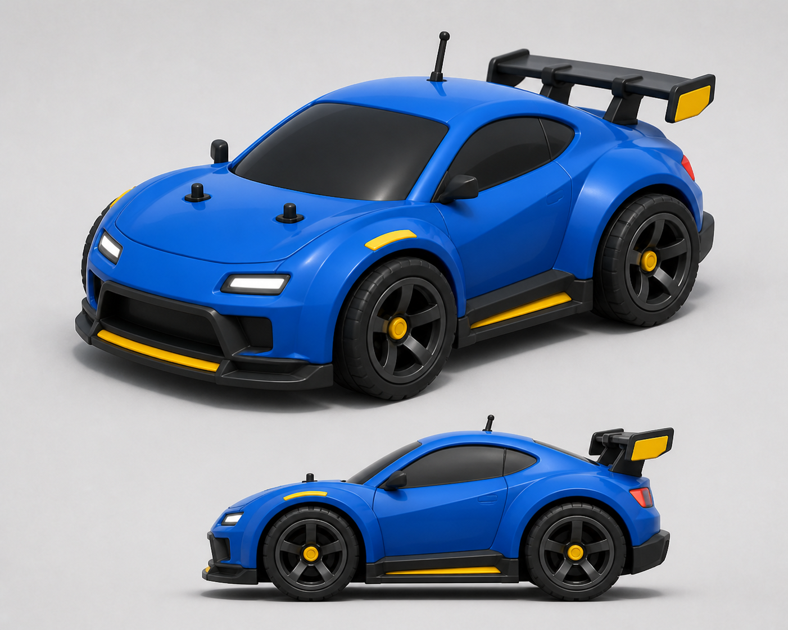
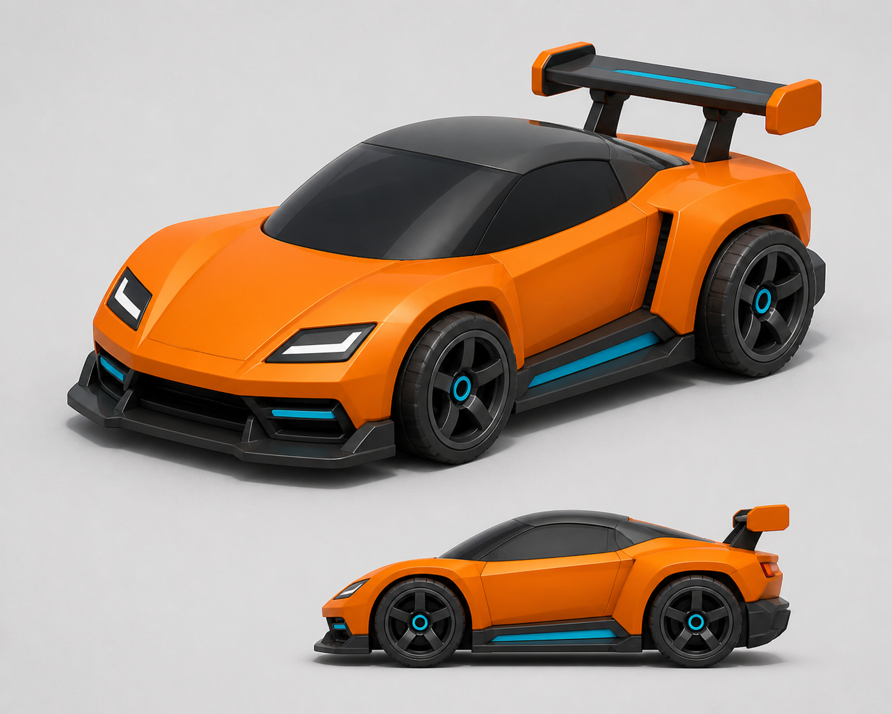
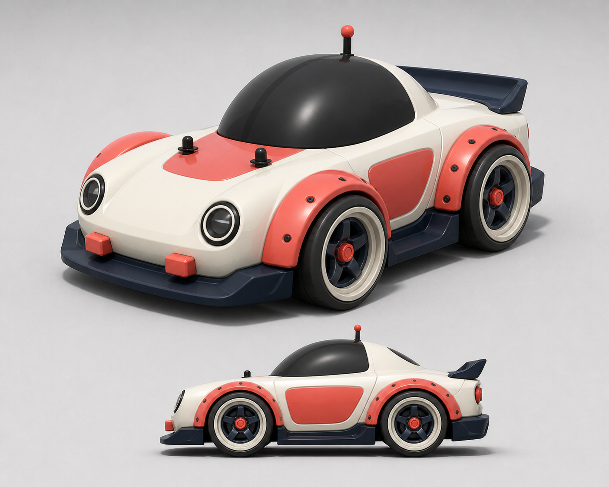

# RC Weekly Time Attack — Visual Direction

## Vehicle concepts

### A. Blue Rally Coupe — Primary direction

- 스포츠 쿠페와 미니 RC카의 균형을 잡은 기본 플레이어 차량
- 짧은 휠베이스, 넓은 휠 아치, 큰 타이어, 견고한 리어 윙을 핵심 실루엣으로 사용
- Unity 목표: 8,000~15,000 triangles의 단일 저폴리 바디 메시와 분리형 휠 4개

### B. Orange Street GT

- 낮고 각진 실루엣을 가진 속도감 중심 대안
- Graphite 하부 파츠와 Cyan 포인트 컬러 사용

### C. Ivory & Coral Club Racer

- 짧고 둥근 비율을 강조한 캐릭터성 중심 대안
- 큰 오버펜더와 버블 캐노피로 미니 RC카 느낌 강화

## Shared art direction

- 실제 자동차를 그대로 복제하지 않은 독자적인 미니 RC카 디자인
- 넓고 부드러운 저폴리 면, 과장된 바퀴와 명확한 실루엣
- 선명한 차체색, 어두운 하부 파츠, 한 가지 포인트 컬러
- 약한 Toon 느낌의 PBR 조명과 부드러운 접지 그림자
- 작은 장식보다 주행 카메라 거리에서도 읽히는 큰 형태를 우선
- 차량과 Ghost는 같은 모델을 사용하고 Ghost 전용 반투명 Material만 교체

## Map kit direction

여러 Weekly Track은 같은 모듈형 키트와 조명 규칙을 공유한다.

- Asphalt 직선, 완만한 커브, S-Curve, Hairpin 모듈
- 빨강/흰색 또는 테마 색상의 둥근 Curb
- 낮고 두꺼운 Guardrail과 충돌 위치가 명확한 Barrier
- 넓은 잔디·모래·작업대 등 단순한 Off-road 영역
- 멀리서도 읽히는 바닥 방향 화살표와 Checkpoint Gate
- 트랙별 `trackId`, `trackVersion`과 공정한 충돌체를 별도로 고정

초기 테마 후보:

1. Garden Circuit — 밝은 잔디와 클래식 Curb의 기본 트랙
2. Rooftop Sprint — 도심 옥상과 긴 직선을 섞은 고속 트랙
3. Workshop Table — 공구와 부품 사이를 달리는 미니어처 테크니컬 트랙
4. Seaside Park — 밝은 해안 색상과 연속 코너 중심 트랙

콘셉트 이미지는 방향 확인용이며 최종 Unity 에셋은 모바일 WebGL 성능과 주행 중 가독성을 기준으로 단순화한다.
