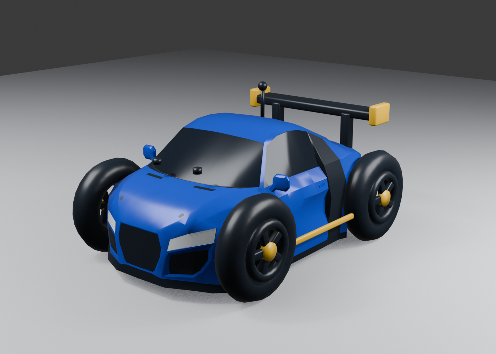

# Blue Rally RC — Unity implementation

## 결과

레퍼런스의 짧고 넓은 스포츠 쿠페 실루엣을 모바일 WebGL용 RC카 FBX로 구현했다. IceMaan의 CC0 `A_R7_Body_3` 베이스 메시를 재비례·재질 통합·파츠 분리한 뒤 전용 휠과 RC 디테일을 추가했다.



- 총 `12,584 triangles`
- Mesh Object `10개`
- 단색 Material `6개`
- 독립 Wheel Object `4개`
- 차체와 별도의 단일 `BoxCollider` 유지
- 플레이어 Wheel 회전과 Front Wheel 조향
- 같은 FBX를 Cyan 반투명 Material로 바꾸는 Ghost

## Mesh objects

| Object | Triangles | 역할 |
|---|---:|---|
| `BodyShell` | 2,283 | 짧고 넓게 재비례한 스포츠 쿠페 차체와 Wheel Arch |
| `Canopy` | 143 | 내부를 생략한 전면·측면 Smoked Glass |
| `AeroKit` | 3,276 | 전후 Bumper, Grille, Intake, Underbody와 Side Aero |
| `Headlights` | 394 | 전면 Lamp와 분리된 Rear Lamp |
| `RearWing` | 540 | Wing Deck, 긴 Post, Yellow End Plate |
| `RCDetails` | 588 | Hood Clip, Antenna, Antenna Tip, Side Accent |
| `Wheel_FL` | 1,340 | Front Left 독립 5-spoke Wheel |
| `Wheel_FR` | 1,340 | Front Right 독립 5-spoke Wheel |
| `Wheel_RL` | 1,340 | Rear Left 독립 5-spoke Wheel |
| `Wheel_RR` | 1,340 | Rear Right 독립 5-spoke Wheel |

## Materials

`M_BlueBody`, `M_Graphite`, `M_SmokedGlass`, `M_YellowAccent`, `M_LampWhite`, `M_TailRed`만 사용한다. 고해상도 Texture, 실내, 미세 Grille, Normal Map은 사용하지 않는다.

## Files

- Unity FBX: `Assets/_Project/Resources/Vehicles/BlueRallyRC.fbx`
- Blender source: `ArtSource/Vehicles/BlueRallyRC/BlueRallyRC.blend`
- Triangle report: `ArtSource/Vehicles/BlueRallyRC/BlueRallyRC.model-report.json`
- CC0 base mesh: `ArtSource/ThirdParty/IceMaan/A_R7/A_R7_Body_3.fbx`
- Source and license: `ArtSource/ThirdParty/IceMaan/A_R7/SOURCE.md`, `LICENSE.txt`
- Generator: `Tools/Blender/generate_blue_rally_rc.py`
- FBX validator: `Tools/Blender/validate_blue_rally_fbx.py`

## Regenerate and validate

프로젝트 루트에서 Blender 명령을 실행한다.

```sh
blender --background --python RC_Weekly_TimeAttack/Tools/Blender/generate_blue_rally_rc.py
blender --background --python RC_Weekly_TimeAttack/Tools/Blender/validate_blue_rally_fbx.py
```

Generator는 최종 Triangle 수가 `8,000..15,000` 범위를 벗어나면 실패한다. Validator는 저장된 FBX를 새 Blender 장면으로 다시 가져와 Mesh 이름, Material, 독립 Wheel, Triangle 수와 축 방향을 검사한다.

## Base mesh license

베이스 차체는 IceMaan의 [Free Car Low Poly](https://icemaan.itch.io/free-car-low-poly)에 포함된 `A_R7_Body_3.fbx`이며 CC0로 배포된다. 원본 차체는 그대로 런타임에 사용하지 않고 Generator에서 RC 비율, Material 6개, Unity 파츠 10개 구조로 재가공한다.

Unity Editor에서는 FBX 임포트 후 `V01_Sandbox` Play Mode에서 차량과 Ghost의 Material, Wheel 회전 방향, Steering 축을 최종 확인한다. 현재 개발 머신에는 Unity Editor가 없으므로 이 단계는 보류한다.
