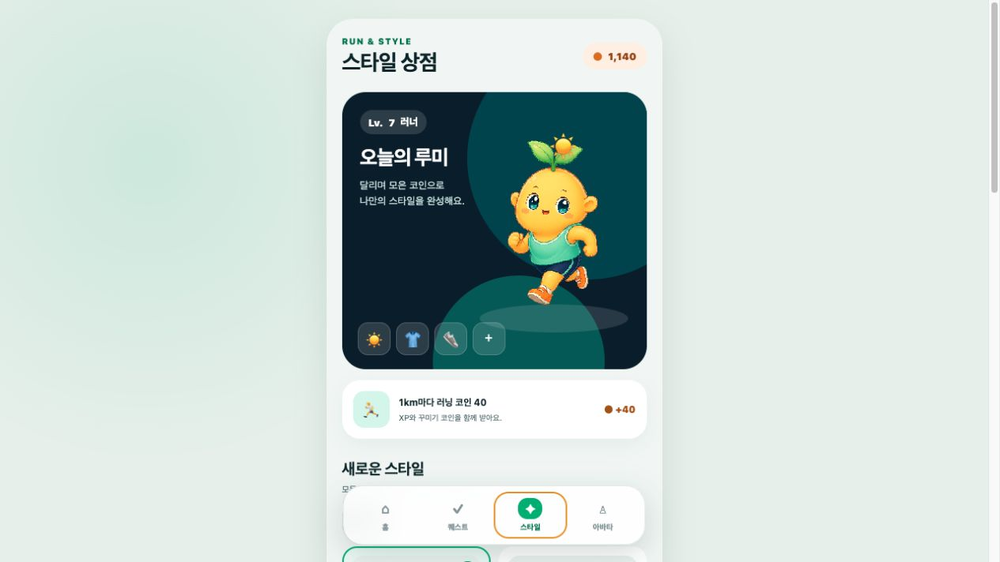
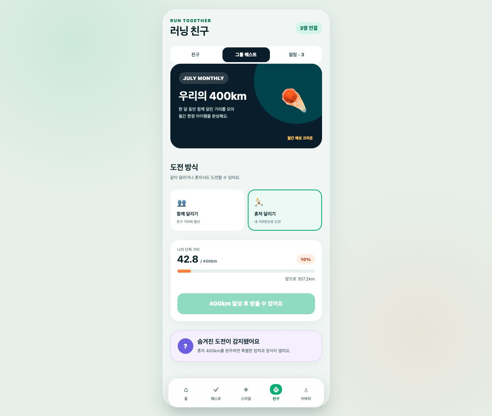

> 달리기로 러너와 아바타를 성장시키고, 친구와 퀘스트·업적을 함께 이어가는 앱인토스 러닝 앱입니다.

# 퀘스트런

퀘스트런은 실제 러닝 기록을 아바타 수집과 자기표현으로 연결하는 앱인토스 미니앱입니다.
몬스터 전투나 능력치 경쟁 없이, 달리기를 꾸준히 할수록 더 많은 스타일을 선택할 수 있습니다.

이 프로젝트는 Android APK나 iOS IPA를 각각 배포하는 독립 앱이 아니라, React Native로
Android/iOS 번들을 함께 생성해 `quest-run.ait`로 앱인토스 콘솔에 배포하는 비게임
토스 미니앱입니다.

## 실행 화면




`preview/index.html`은 단순 이미지가 아닌 실행형 브라우저 데모입니다. 데모 러닝을
완료하면 러너 레벨 경험치와 러닝 코인이 늘어나며, 스타일 상점에서 아이템을 구매하고
아바타에 즉시 착용할 수 있습니다. 친구 프로필, 알림, 팀·솔로 월간 그룹 퀘스트도
직접 눌러볼 수 있고 퀘스트 보상과 착용 상태는 브라우저에 자동 저장됩니다.

```bash
python3 -m http.server 4173
```

실행 후 `http://127.0.0.1:4173/preview/`를 엽니다.

## 현재 구현 범위

- 홈, 실시간 러닝, 퀘스트, 스타일 상점, 친구, 내 아바타 화면
- 작은 이목구비·오버핏 러닝웨어·부드러운 2.5D 인형 질감에 새싹 모티프를 더한 전용 러너 캐릭터 `루미`
- 앱인토스 위치 권한을 이용한 실제 GPS 러닝 기록
- 앱인토스 비게임 내비게이션과 Android/iOS 공통 React Native 번들
- 러닝 시작 전 위치 사용 목적 안내 및 사용자 동의 후 권한 요청
- 사용자가 완료할 때까지 제한 없이 누적되는 러닝 거리와 거리 비례 보상
- 부정확한 위치와 비정상적인 GPS 점프를 제외한 거리·페이스 계산
- 러닝 중 현재·평균·최고 속도와 평균 페이스 표시
- 완료 후 이동 시간·예상 칼로리·운동 경로 요약
- 원본 GPS 좌표를 저장하지 않는 상대 경로 지도
- 앱이 백그라운드로 전환될 때 러닝 자동 일시정지
- 러닝 거리 기반 러너 레벨 경험치와 꾸미기 전용 러닝 코인 지급
- 러닝 코인으로 꾸미기 아이템 구매
- 러닝 코인으로 눈·코·입 모양을 각각 구매하고 조합하는 얼굴 커스터마이징
- 기본 머리·상의·하의·신발 슬롯과 업적으로 해금되는 안경·가방·시계 슬롯
- 능력치 효과가 없는 순수 아바타 꾸미기
- 일일·주간·연속 달성 퀘스트와 지구력 기록
- 7일 연속, 누적 100km, 제주·서울 지역 러닝 등 일반·숨은 업적
- 업적 보상으로 꾸미기 아이템과 새로운 장착 부위 동시 해금
- 주간 10km 완주 반다나처럼 코인으로 살 수 없는 기념 아이템
- 친구 목록과 공개 프로필에서 캐릭터·러너 레벨·퀘스트·업적 상태 확인
- 친구의 퀘스트·업적 진행 알림과 확인 상태 저장
- 매월 팀 누적 400km 그룹 퀘스트 및 월간 한정 아이템
- 같은 그룹 퀘스트를 혼자 완주할 수 있는 솔로 모드와 전용 숨은 업적
- 러닝·아바타·퀘스트 상태의 기기 내 자동 저장
- 기존 저장 데이터의 코인을 새 꾸미기 재화로 안전하게 전환
- GPS 없이 핵심 보상 흐름을 확인하는 개발용 테스트 러닝
- 앱인토스 내비게이션 및 위치 권한 설정

## 보상 규칙

- 1km 러닝: 100 XP + 러닝 코인 40
- 러너 레벨: 기존 경험치 성장 방식 유지
- 러닝 코인: 스타일 상점 구매에만 사용
- 지역·주간 한정 아이템: 조건 달성으로만 획득
- 모든 아이템: 러닝 성능과 기록에 영향을 주지 않는 꾸미기 전용

## 실행

```bash
pnpm install
pnpm dev
```

앱인토스 샌드박스 앱에서 `intoss://quest-run` 스킴으로 실행합니다.

개발 서버에서 홈 화면 오른쪽 위의 설정 버튼을 누르면 `테스트 러닝`을 열 수 있습니다.
서울 2km, 제주 5km, 짧은 500m 시나리오와 저장 데이터 초기화를 제공하며 실제 GPS
기록과 같은 보상 흐름으로 처리됩니다.

## 앱인토스 출시

콘솔 업로드용 브랜드 아이콘은 `assets/quest-run-app-icon-600.png`에 준비되어 있습니다.
이 파일을 앱인토스 콘솔에 업로드한 뒤 발급된 이미지 URL을 환경 변수에 넣어야 실제
출시용 번들을 만들 수 있습니다.

```bash
set -a
source .env.release
set +a
pnpm release:build
pnpm release:upload
```

비게임 앱 필수 ‘앱 내 기능’으로 `러닝 시작하기` → `intoss://quest-run/run`을 등록할 수
있습니다. 전체 콘솔 등록, 샌드박스·QR 테스트, 검토 요청 순서는
[앱인토스 출시 가이드](docs/apps-in-toss-release.md)를 확인하세요.

## 검증

```bash
pnpm test
pnpm typecheck
pnpm lint
pnpm build
```

## 현재 상태

GPS 러닝부터 러너 레벨, 퀘스트, 아바타 꾸미기, 친구·그룹 도전까지 체험할 수 있는 MVP입니다.
러닝 기록은 현재 기기 안에 저장됩니다. 실제 배포 단계에서는 기록 위변조 검증,
정확한 행정구역 판별, 실제 친구 계정과 그룹 거리 동기화를 위한 서버 연결이 추가로 필요합니다.
현재 경로는 별도 지도 키 없이 동작하는 개인정보 보호형 경로 카드이며, 실제 도로
지도가 필요할 때 Google Maps Static API 등의 키와 이용 정책을 검토해 교체할 수 있습니다.
