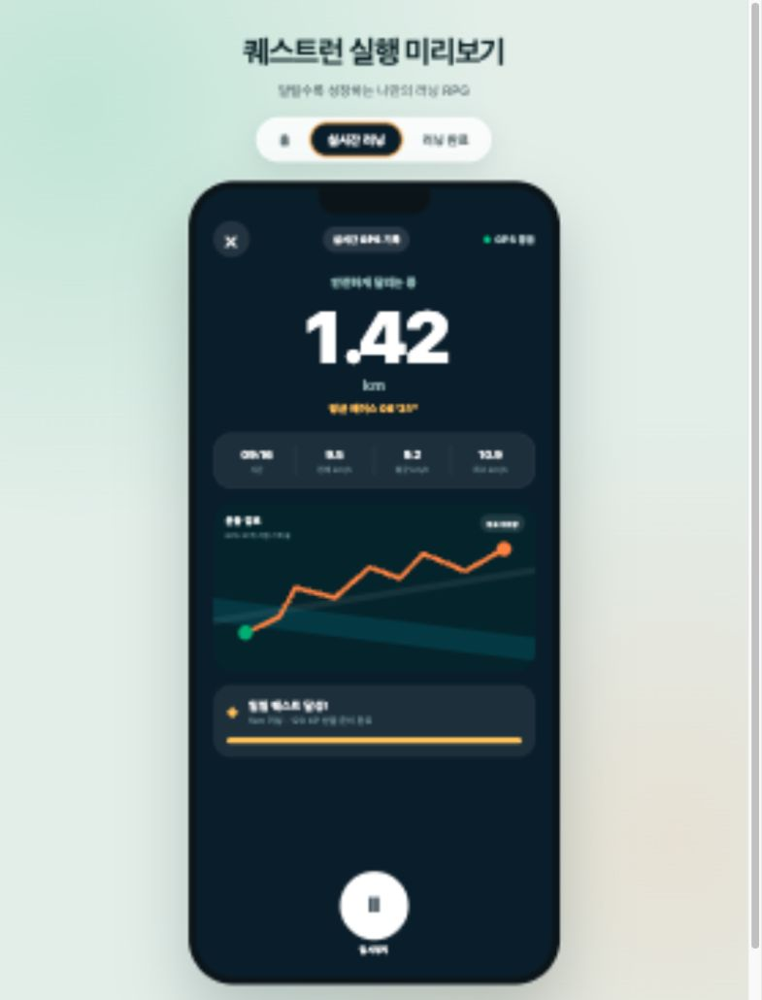
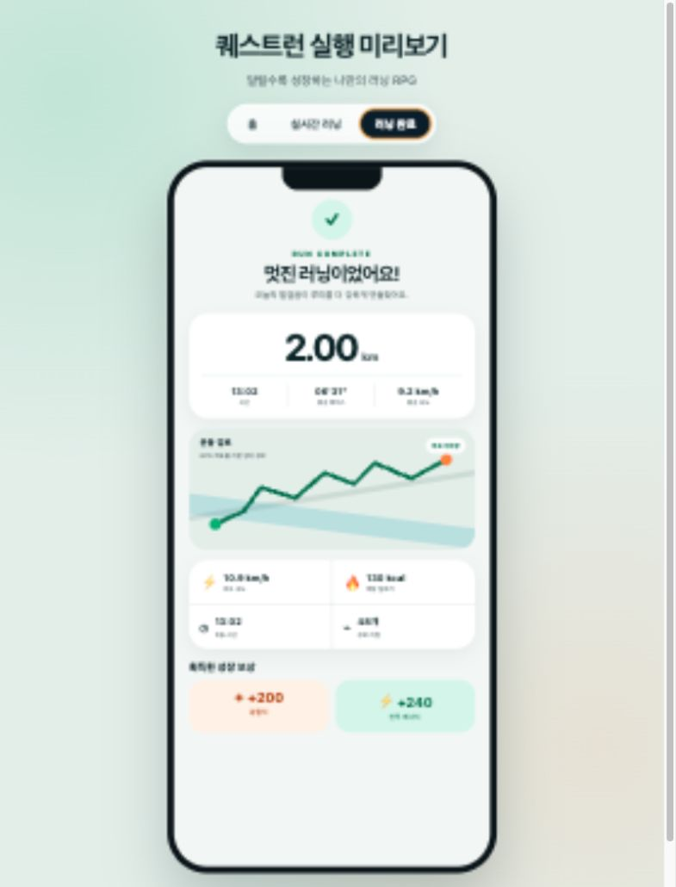

> 현실에서 달리면 캐릭터가 성장하고 장비와 지역 한정 꾸미기 아이템을 모으는 앱인토스 러닝 RPG입니다.

# 퀘스트런

퀘스트런은 실제 러닝 기록을 캐릭터 성장과 모험으로 연결하는 앱인토스 미니앱입니다.

## 실행 화면

| 홈 | 실시간 러닝 | 러닝 완료 |
| --- | --- | --- |
|  |  |  |

브라우저용 화면 미리보기는 `preview/index.html`에서 홈, 실시간 러닝,
러닝 완료 화면을 전환하며 확인할 수 있습니다.

## 현재 구현 범위

- 홈, 러닝, 퀘스트, 모험, 캐릭터 화면
- 앱인토스 위치 권한을 이용한 실제 GPS 러닝 기록
- 부정확한 위치와 비정상적인 GPS 점프를 제외한 거리·페이스 계산
- 러닝 중 현재·평균·최고 속도와 평균 페이스 표시
- 완료 후 이동 시간·예상 칼로리·운동 경로 요약
- 원본 GPS 좌표를 저장하지 않는 상대 경로 지도
- 앱이 백그라운드로 전환될 때 러닝 자동 일시정지
- 경험치·전투 에너지·지구력 성장 규칙
- 일일·주간·연속 달성 퀘스트
- 조건을 공개하지 않는 숨은 지역 업적
- 전투 능력치와 분리된 지역 한정 꾸미기 보상
- 러닝·캐릭터·퀘스트 상태의 기기 내 자동 저장
- GPS 없이 핵심 보상 흐름을 확인하는 개발용 테스트 러닝
- 퀘스트 장비·골드 보상과 최근 러닝 기록
- 앱인토스 게임 내비게이션 및 위치 권한 설정

## 실행

```bash
pnpm install
pnpm dev
```

앱인토스 샌드박스 앱에서 `intoss://quest-run` 스킴으로 실행합니다.

개발 서버에서 홈 화면 오른쪽 위의 설정 버튼을 누르면 `테스트 러닝`을
열 수 있습니다. 서울 2km, 제주 5km, 짧은 500m 시나리오와 저장 데이터
초기화를 제공하며 실제 GPS 기록과 같은 보상 흐름으로 처리됩니다.

## 검증

```bash
pnpm test
pnpm typecheck
pnpm lint
pnpm build
```

## 현재 상태

GPS 러닝부터 성장, 퀘스트, 몬스터 전투까지 한 번에 체험할 수 있는 첫 번째 MVP입니다.
러닝 기록은 현재 기기 안에 저장됩니다. 실제 배포 단계에서는 기록 위변조 검증,
정확한 행정구역 판별, 계정 간 동기화를 위한 서버 연결이 추가로 필요합니다.
현재 경로는 별도 지도 키 없이 동작하는 개인정보 보호형 경로 카드이며, 실제 도로
지도가 필요할 때 Google Maps Static API 등의 키와 이용 정책을 검토해 교체할 수 있습니다.
